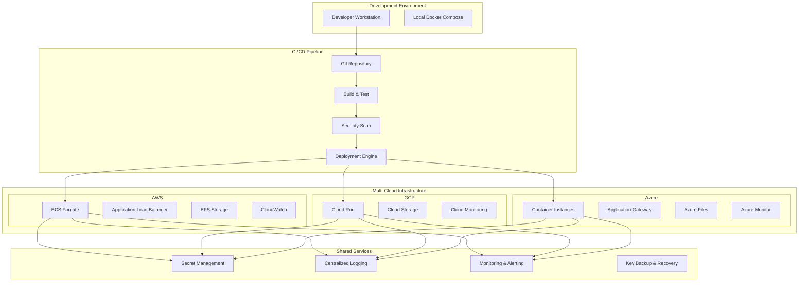
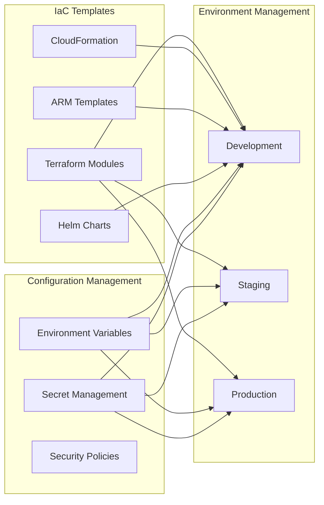

# Enhanced Cloud Deployment Design Document

## Overview

This design document outlines a comprehensive, production-ready cloud deployment solution for the PQC Secure Transfer System. The solution builds upon the existing Docker containerization and basic deployment documentation to provide automated infrastructure provisioning, CI/CD pipelines, monitoring, security, and multi-environment management across AWS, GCP, and Azure.

The design focuses on creating a robust, scalable, and secure deployment platform that can handle the system's unique requirements for quantum-safe cryptography and large file transfers (15-20GB) while maintaining high availability and operational excellence.

## Architecture

### High-Level Architecture



### Infrastructure as Code Architecture



## Components and Interfaces

### 1. Infrastructure Provisioning Engine

**Purpose**: Automated infrastructure provisioning across multiple cloud providers using Infrastructure as Code.

**Components**:
- **Terraform Modules**: Reusable infrastructure components for AWS, GCP, and Azure
- **Cloud-Specific Templates**: CloudFormation (AWS), Deployment Manager (GCP), ARM Templates (Azure)
- **Environment Configuration**: Environment-specific variable files and policies
- **State Management**: Remote state storage with locking and versioning

**Interfaces**:
```yaml
# terraform/modules/pqc-deployment/variables.tf
variable "environment" {
  description = "Environment name (dev/staging/prod)"
  type        = string
}

variable "cloud_provider" {
  description = "Cloud provider (aws/gcp/azure)"
  type        = string
}

variable "instance_count" {
  description = "Number of container instances"
  type        = number
  default     = 2
}

variable "instance_size" {
  description = "Container instance size"
  type        = string
  default     = "medium"
}

variable "enable_autoscaling" {
  description = "Enable auto-scaling"
  type        = bool
  default     = true
}

variable "pqc_algorithm" {
  description = "PQC algorithm to use"
  type        = string
  default     = "Kyber768"
}
```

### 2. CI/CD Pipeline Engine

**Purpose**: Automated build, test, security scanning, and deployment pipeline with multi-environment support.

**Components**:
- **Build System**: Docker image building with multi-stage optimization
- **Security Scanner**: Container vulnerability scanning and PQC library validation
- **Test Runner**: Unit tests, integration tests, and performance benchmarks
- **Deployment Orchestrator**: Environment-specific deployment with rollback capabilities
- **Approval Gates**: Manual approval workflows for production deployments

**Pipeline Configuration**:
```yaml
# .github/workflows/deploy.yml
name: Enhanced Cloud Deployment

on:
  push:
    branches: [main, develop]
  pull_request:
    branches: [main]

jobs:
  build-and-test:
    runs-on: ubuntu-latest
    steps:
      - name: Checkout code
        uses: actions/checkout@v4
      
      - name: Build Docker image
        run: |
          docker build -t pqc-secure-transfer:${{ github.sha }} .
      
      - name: Security scan
        uses: aquasecurity/trivy-action@master
        with:
          image-ref: pqc-secure-transfer:${{ github.sha }}
          format: 'sarif'
          output: 'trivy-results.sarif'
      
      - name: Test PQC functionality
        run: |
          docker run --rm pqc-secure-transfer:${{ github.sha }} python test_system.py
      
      - name: Performance benchmark
        run: |
          docker run --rm pqc-secure-transfer:${{ github.sha }} python -c "
          from pqc_secure_transfer import StreamingEncryptor
          import time
          # Performance test for large file encryption
          "

  deploy-staging:
    needs: build-and-test
    if: github.ref == 'refs/heads/develop'
    runs-on: ubuntu-latest
    steps:
      - name: Deploy to staging
        run: |
          ./scripts/deploy.sh staging ${{ github.sha }}

  deploy-production:
    needs: build-and-test
    if: github.ref == 'refs/heads/main'
    runs-on: ubuntu-latest
    environment: production
    steps:
      - name: Deploy to production
        run: |
          ./scripts/deploy.sh production ${{ github.sha }}
```

### 3. Monitoring and Observability System

**Purpose**: Comprehensive monitoring, logging, and alerting for PQC-specific metrics and large file transfer operations.

**Components**:
- **Metrics Collection**: Custom metrics for PQC operations, transfer throughput, and system health
- **Log Aggregation**: Centralized logging with structured logs and correlation IDs
- **Alerting Engine**: Intelligent alerting based on performance thresholds and security events
- **Dashboards**: Real-time dashboards for operational visibility
- **Distributed Tracing**: End-to-end tracing for file transfer operations

**Monitoring Configuration**:
```yaml
# monitoring/prometheus-config.yml
global:
  scrape_interval: 15s
  evaluation_interval: 15s

rule_files:
  - "pqc_alerts.yml"

scrape_configs:
  - job_name: 'pqc-secure-transfer'
    static_configs:
      - targets: ['pqc-server:8765']
    metrics_path: '/metrics'
    scrape_interval: 10s

  - job_name: 'pqc-performance'
    static_configs:
      - targets: ['pqc-server:8765']
    metrics_path: '/performance-metrics'
    scrape_interval: 30s

alerting:
  alertmanagers:
    - static_configs:
        - targets:
          - alertmanager:9093
```

**Custom Metrics**:
```python
# monitoring/metrics.py
from prometheus_client import Counter, Histogram, Gauge

# PQC-specific metrics
pqc_key_exchanges = Counter('pqc_key_exchanges_total', 'Total PQC key exchanges')
pqc_key_exchange_duration = Histogram('pqc_key_exchange_duration_seconds', 'PQC key exchange duration')
pqc_encryption_throughput = Gauge('pqc_encryption_throughput_mbps', 'Encryption throughput in MB/s')

# Transfer metrics
file_transfer_size = Histogram('file_transfer_size_bytes', 'File transfer size distribution')
file_transfer_duration = Histogram('file_transfer_duration_seconds', 'File transfer duration')
active_transfers = Gauge('active_transfers', 'Number of active file transfers')

# Security metrics
failed_authentications = Counter('failed_authentications_total', 'Failed authentication attempts')
key_rotation_events = Counter('key_rotation_events_total', 'Key rotation events')
```

### 4. Secret Management System

**Purpose**: Secure management of PQC cryptographic keys, certificates, and configuration secrets across all environments.

**Components**:
- **Key Vault Integration**: Integration with AWS Secrets Manager, GCP Secret Manager, Azure Key Vault
- **Key Rotation Engine**: Automated rotation of PQC keys and certificates
- **Backup and Recovery**: Encrypted backup of cryptographic materials with disaster recovery
- **Access Control**: Fine-grained access control with audit logging
- **Key Lifecycle Management**: Complete lifecycle management from generation to destruction

**Secret Management Interface**:
```python
# security/secret_manager.py
from abc import ABC, abstractmethod
from typing import Dict, Optional
import boto3
from google.cloud import secretmanager
from azure.keyvault.secrets import SecretClient

class SecretManager(ABC):
    @abstractmethod
    def store_secret(self, name: str, value: str, metadata: Dict = None) -> bool:
        pass
    
    @abstractmethod
    def retrieve_secret(self, name: str) -> Optional[str]:
        pass
    
    @abstractmethod
    def rotate_key(self, key_name: str) -> bool:
        pass
    
    @abstractmethod
    def backup_keys(self, backup_location: str) -> bool:
        pass

class AWSSecretManager(SecretManager):
    def __init__(self, region: str):
        self.client = boto3.client('secretsmanager', region_name=region)
    
    def store_secret(self, name: str, value: str, metadata: Dict = None) -> bool:
        try:
            self.client.create_secret(
                Name=name,
                SecretString=value,
                Description=metadata.get('description', '') if metadata else ''
            )
            return True
        except Exception as e:
            logger.error(f"Failed to store secret: {e}")
            return False

class GCPSecretManager(SecretManager):
    def __init__(self, project_id: str):
        self.client = secretmanager.SecretManagerServiceClient()
        self.project_id = project_id
    
    def store_secret(self, name: str, value: str, metadata: Dict = None) -> bool:
        # Implementation for GCP Secret Manager
        pass

class AzureSecretManager(SecretManager):
    def __init__(self, vault_url: str):
        self.client = SecretClient(vault_url=vault_url, credential=DefaultAzureCredential())
    
    def store_secret(self, name: str, value: str, metadata: Dict = None) -> bool:
        # Implementation for Azure Key Vault
        pass
```

### 5. Auto-Scaling Engine

**Purpose**: Intelligent auto-scaling based on PQC workload patterns and large file transfer demands.

**Components**:
- **Metrics-Based Scaling**: Scaling based on CPU, memory, network, and custom PQC metrics
- **Predictive Scaling**: ML-based scaling predictions for federated learning workloads
- **Queue-Based Scaling**: Scaling based on transfer request queue length
- **Cost Optimization**: Intelligent scaling to balance performance and cost
- **Multi-Cloud Scaling**: Unified scaling policies across different cloud providers

**Scaling Configuration**:
```yaml
# scaling/autoscaling-policy.yml
apiVersion: v1
kind: ConfigMap
metadata:
  name: pqc-autoscaling-config
data:
  scaling-policy.json: |
    {
      "metrics": [
        {
          "name": "cpu_utilization",
          "target": 70,
          "scale_up_threshold": 80,
          "scale_down_threshold": 30
        },
        {
          "name": "memory_utilization", 
          "target": 75,
          "scale_up_threshold": 85,
          "scale_down_threshold": 40
        },
        {
          "name": "active_transfers",
          "target": 10,
          "scale_up_threshold": 15,
          "scale_down_threshold": 5
        },
        {
          "name": "transfer_queue_length",
          "target": 5,
          "scale_up_threshold": 10,
          "scale_down_threshold": 2
        }
      ],
      "scaling_limits": {
        "min_instances": 1,
        "max_instances": 50,
        "scale_up_cooldown": 300,
        "scale_down_cooldown": 600
      },
      "cost_optimization": {
        "enable_spot_instances": true,
        "spot_instance_percentage": 70,
        "enable_scheduled_scaling": true
      }
    }
```

## Data Models

### 1. Deployment Configuration Model

```python
# models/deployment_config.py
from dataclasses import dataclass
from typing import Dict, List, Optional
from enum import Enum

class CloudProvider(Enum):
    AWS = "aws"
    GCP = "gcp"
    AZURE = "azure"

class Environment(Enum):
    DEVELOPMENT = "dev"
    STAGING = "staging"
    PRODUCTION = "prod"

@dataclass
class ResourceLimits:
    cpu: str
    memory: str
    storage: str
    max_instances: int
    min_instances: int

@dataclass
class SecurityConfig:
    enable_encryption_at_rest: bool
    enable_encryption_in_transit: bool
    pqc_algorithm: str
    key_rotation_days: int
    enable_audit_logging: bool

@dataclass
class MonitoringConfig:
    enable_metrics: bool
    enable_logging: bool
    enable_tracing: bool
    log_retention_days: int
    alert_endpoints: List[str]

@dataclass
class DeploymentConfig:
    name: str
    environment: Environment
    cloud_provider: CloudProvider
    region: str
    resource_limits: ResourceLimits
    security_config: SecurityConfig
    monitoring_config: MonitoringConfig
    custom_env_vars: Dict[str, str]
    tags: Dict[str, str]
```

### 2. Monitoring Data Model

```python
# models/monitoring.py
from dataclasses import dataclass
from datetime import datetime
from typing import Optional, Dict, Any

@dataclass
class MetricPoint:
    timestamp: datetime
    value: float
    labels: Dict[str, str]

@dataclass
class Alert:
    id: str
    name: str
    severity: str
    message: str
    timestamp: datetime
    resolved: bool
    metadata: Dict[str, Any]

@dataclass
class HealthCheck:
    service_name: str
    status: str  # healthy, unhealthy, degraded
    timestamp: datetime
    response_time_ms: float
    details: Dict[str, Any]

@dataclass
class TransferMetrics:
    transfer_id: str
    file_size_bytes: int
    transfer_duration_seconds: float
    throughput_mbps: float
    encryption_algorithm: str
    success: bool
    error_message: Optional[str]
```

## Error Handling

### 1. Deployment Error Handling

```python
# error_handling/deployment_errors.py
class DeploymentError(Exception):
    """Base class for deployment errors"""
    pass

class InfrastructureProvisioningError(DeploymentError):
    """Raised when infrastructure provisioning fails"""
    def __init__(self, provider: str, resource: str, error_details: str):
        self.provider = provider
        self.resource = resource
        self.error_details = error_details
        super().__init__(f"Failed to provision {resource} on {provider}: {error_details}")

class SecurityScanError(DeploymentError):
    """Raised when security scanning fails"""
    def __init__(self, scan_type: str, vulnerabilities: List[str]):
        self.scan_type = scan_type
        self.vulnerabilities = vulnerabilities
        super().__init__(f"Security scan {scan_type} failed with vulnerabilities: {vulnerabilities}")

class ConfigurationError(DeploymentError):
    """Raised when configuration validation fails"""
    def __init__(self, config_key: str, expected: str, actual: str):
        self.config_key = config_key
        self.expected = expected
        self.actual = actual
        super().__init__(f"Configuration error for {config_key}: expected {expected}, got {actual}")

# Error recovery strategies
class ErrorRecoveryStrategy:
    @staticmethod
    def handle_infrastructure_error(error: InfrastructureProvisioningError) -> bool:
        """Attempt to recover from infrastructure provisioning errors"""
        if "quota exceeded" in error.error_details.lower():
            # Try alternative region or instance type
            return ErrorRecoveryStrategy._try_alternative_resources(error)
        elif "permission denied" in error.error_details.lower():
            # Check and update IAM permissions
            return ErrorRecoveryStrategy._update_permissions(error)
        return False
    
    @staticmethod
    def handle_security_scan_error(error: SecurityScanError) -> bool:
        """Handle security scan failures"""
        critical_vulnerabilities = [v for v in error.vulnerabilities if "CRITICAL" in v]
        if not critical_vulnerabilities:
            # Only non-critical vulnerabilities, proceed with warnings
            logger.warning(f"Non-critical vulnerabilities found: {error.vulnerabilities}")
            return True
        return False
```

### 2. Runtime Error Handling

```python
# error_handling/runtime_errors.py
class RuntimeError(Exception):
    """Base class for runtime errors"""
    pass

class ScalingError(RuntimeError):
    """Raised when auto-scaling operations fail"""
    pass

class MonitoringError(RuntimeError):
    """Raised when monitoring systems fail"""
    pass

class SecretManagementError(RuntimeError):
    """Raised when secret management operations fail"""
    pass

# Circuit breaker pattern for external services
class CircuitBreaker:
    def __init__(self, failure_threshold: int = 5, recovery_timeout: int = 60):
        self.failure_threshold = failure_threshold
        self.recovery_timeout = recovery_timeout
        self.failure_count = 0
        self.last_failure_time = None
        self.state = "CLOSED"  # CLOSED, OPEN, HALF_OPEN
    
    def call(self, func, *args, **kwargs):
        if self.state == "OPEN":
            if time.time() - self.last_failure_time > self.recovery_timeout:
                self.state = "HALF_OPEN"
            else:
                raise RuntimeError("Circuit breaker is OPEN")
        
        try:
            result = func(*args, **kwargs)
            if self.state == "HALF_OPEN":
                self.state = "CLOSED"
                self.failure_count = 0
            return result
        except Exception as e:
            self.failure_count += 1
            self.last_failure_time = time.time()
            
            if self.failure_count >= self.failure_threshold:
                self.state = "OPEN"
            
            raise e
```

## Testing Strategy

### 1. Infrastructure Testing

```python
# tests/infrastructure/test_terraform.py
import pytest
import subprocess
import json
from pathlib import Path

class TestTerraformModules:
    def test_terraform_validate(self):
        """Test that all Terraform configurations are valid"""
        terraform_dirs = Path("terraform").glob("*/")
        for tf_dir in terraform_dirs:
            result = subprocess.run(
                ["terraform", "validate"],
                cwd=tf_dir,
                capture_output=True,
                text=True
            )
            assert result.returncode == 0, f"Terraform validation failed for {tf_dir}: {result.stderr}"
    
    def test_terraform_plan(self):
        """Test that Terraform plan succeeds for all environments"""
        environments = ["dev", "staging", "prod"]
        for env in environments:
            result = subprocess.run(
                ["terraform", "plan", f"-var-file=environments/{env}.tfvars"],
                cwd="terraform/main",
                capture_output=True,
                text=True
            )
            assert result.returncode == 0, f"Terraform plan failed for {env}: {result.stderr}"

class TestCloudFormation:
    def test_cloudformation_validate(self):
        """Test CloudFormation template validation"""
        cf_templates = Path("cloudformation").glob("*.yaml")
        for template in cf_templates:
            result = subprocess.run(
                ["aws", "cloudformation", "validate-template", "--template-body", f"file://{template}"],
                capture_output=True,
                text=True
            )
            assert result.returncode == 0, f"CloudFormation validation failed for {template}: {result.stderr}"
```

### 2. Deployment Testing

```python
# tests/deployment/test_deployment.py
import pytest
import docker
import requests
import time
from typing import Dict, Any

class TestDeployment:
    @pytest.fixture
    def docker_client(self):
        return docker.from_env()
    
    def test_docker_image_build(self, docker_client):
        """Test that Docker image builds successfully"""
        image, logs = docker_client.images.build(path=".", tag="pqc-secure-transfer:test")
        assert image is not None
        
        # Test image can run
        container = docker_client.containers.run(
            "pqc-secure-transfer:test",
            command="python -c 'import pqc_secure_transfer; print(\"OK\")'",
            remove=True,
            detach=False
        )
        assert "OK" in container.decode()
    
    def test_security_scan(self):
        """Test security scanning of Docker image"""
        result = subprocess.run(
            ["trivy", "image", "--format", "json", "pqc-secure-transfer:test"],
            capture_output=True,
            text=True
        )
        assert result.returncode == 0
        
        scan_results = json.loads(result.stdout)
        critical_vulns = [
            vuln for result in scan_results.get("Results", [])
            for vuln in result.get("Vulnerabilities", [])
            if vuln.get("Severity") == "CRITICAL"
        ]
        assert len(critical_vulns) == 0, f"Critical vulnerabilities found: {critical_vulns}"
    
    def test_performance_benchmarks(self):
        """Test performance benchmarks meet requirements"""
        # Test encryption throughput
        from pqc_secure_transfer import StreamingEncryptor
        import tempfile
        import os
        
        # Create test file
        test_size = 100 * 1024 * 1024  # 100MB
        with tempfile.NamedTemporaryFile(delete=False) as f:
            f.write(os.urandom(test_size))
            test_file = f.name
        
        # Test encryption performance
        key = os.urandom(32)
        encryptor = StreamingEncryptor(key)
        
        start_time = time.time()
        encryptor.encrypt_file(test_file, test_file + ".enc")
        duration = time.time() - start_time
        
        throughput_mbps = (test_size / (1024 * 1024)) / duration
        assert throughput_mbps > 50, f"Encryption throughput too low: {throughput_mbps} MB/s"
        
        # Cleanup
        os.unlink(test_file)
        os.unlink(test_file + ".enc")
```

### 3. End-to-End Testing

```python
# tests/e2e/test_cloud_deployment.py
import pytest
import requests
import websockets
import asyncio
import os
from typing import Dict

class TestCloudDeployment:
    @pytest.mark.parametrize("environment", ["staging", "prod"])
    def test_service_health(self, environment: str):
        """Test service health endpoints"""
        base_url = os.getenv(f"{environment.upper()}_SERVICE_URL")
        assert base_url, f"Service URL not configured for {environment}"
        
        response = requests.get(f"{base_url}/health", timeout=30)
        assert response.status_code == 200
        
        health_data = response.json()
        assert health_data["status"] == "healthy"
        assert "pqc_algorithm" in health_data
        assert health_data["pqc_algorithm"] == "Kyber768"
    
    @pytest.mark.asyncio
    async def test_file_transfer_e2e(self):
        """Test end-to-end file transfer"""
        service_url = os.getenv("STAGING_SERVICE_URL")
        ws_url = service_url.replace("http", "ws")
        
        # Create test file
        test_data = os.urandom(1024 * 1024)  # 1MB test file
        
        async with websockets.connect(ws_url) as websocket:
            # Send file transfer request
            await websocket.send(json.dumps({
                "action": "transfer_file",
                "filename": "test_file.dat",
                "size": len(test_data)
            }))
            
            # Receive response
            response = await websocket.recv()
            response_data = json.loads(response)
            
            assert response_data["status"] == "ready"
            assert "session_key" in response_data
    
    def test_auto_scaling(self):
        """Test auto-scaling functionality"""
        # This would involve generating load and verifying scaling behavior
        # Implementation depends on specific cloud provider and monitoring setup
        pass
    
    def test_monitoring_metrics(self):
        """Test that monitoring metrics are being collected"""
        metrics_url = os.getenv("METRICS_ENDPOINT")
        if metrics_url:
            response = requests.get(f"{metrics_url}/metrics")
            assert response.status_code == 200
            
            metrics_text = response.text
            assert "pqc_key_exchanges_total" in metrics_text
            assert "file_transfer_duration_seconds" in metrics_text
```

This comprehensive design provides a robust foundation for enhancing your PQC secure transfer system with enterprise-grade cloud deployment capabilities. The architecture addresses all requirements while maintaining the system's core quantum-safe cryptography features and large file transfer capabilities.